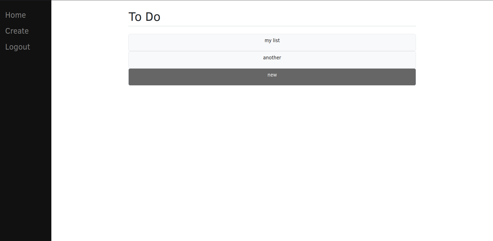

# Todo List

This is a todo list application created using Django and bootstrap

## Setup



### Docker
You can use docker to create an image and then use the application

```bash
docker build . -t todo
docker run -it --rm -p 80:80 todo
```

### Local
To run the app locally you need to setup the DJANGO_SECRET environment variable and install all the requirements

```
pip install -r requirements.txt

echo DJANGO_SECRET=$(python3 -c 'from django.core.management.utils import get_random_secret_key; print(get_random_secret_key())') >> .env

# setup the sqlite db
python manage.py makemigrations
RUN python manage.py migrate

# finally run the server
python manager.py runserver
```